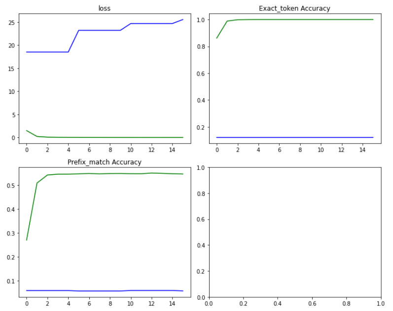
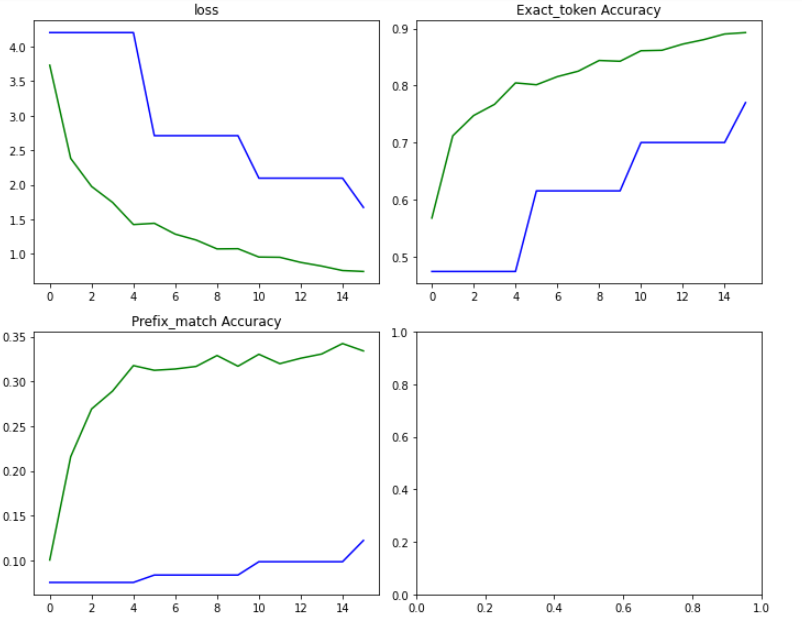

# Coding Assignment #3

    In this assignment, you will implement a seq-to-seq model using lstms with and without attention.

## Model - LSTM(Encoder-Decoder) 

## Architecture  
### Encoder
    1. Embedding Layer
    2. LSTM layer 
     
### Decoder
    1. Action Embedding layer
    2. Target Embedding layer 
    3. Lstm layer
### EncoderDecoder Wrapper
    1. Two fullyconnected layers - one for action and one for target.
    
## Dimensions  
    1. 100 embedding dimension
    2. 3000 vocab_size
    3. 128 hidden dimension
    4. 128 batch_size

## Loss Function and Optimizer  
    1. CrossEntropy
    2. SGD with learning_rate = 0.01

## Training Loop  
    1. Epochs = 16 (training for each epoch took around 40 seconds without attention and 4 minutes with attention)
    2. Validation every 5 epochs.

## Metrics
    1. Exact token matching -> If predicted action token matches with the gt action label or if predicted target token is matching with gt target label in a pair of (action, target)

    2. Prefix matching as defined in the utils.py file. It is used to check the accuracy of the sequence of (action, target) pairs from the start until the first mismatched prediction.

## Implementation
    1. Vanilla LSTM Encoder-Decoder model with teacher forcing and student forcing defined in the encoderdecoder wrapper class of the model itself.
    2. LSTM Encoder-Decoder with global and soft attention implementation in the decoder class.

## Results
LEGEND: Blue - Validation, Green - Training.
1. Training with teacher forcing and evaluating with student forcing.  
    


2. Training with teacher+student forcing using a ratio  
 


3. Training with teacher forcing and evaluating with student forcing with attention.
 

4. Training with teacher+student forcing with attention.
 
    
5. Scores (Validation set):  
    a. Vanilla Encoder-Decoder (Teacher Forcing during training and Student Forcing during validation )   
    Exact_token = 12%  
    Prefix_match = 5.7%  
    
    b.Vanilla Encoder-Decoder (Teacher + Student Forcing during training)  
    Exact_token = 77.03%  
    Prefix_match = 12.23%  

    c.Encoder-Decoder with Attention (Teacher Forcing during training and Student Forcing during validation )  
    Exact_token = 12.08%  
    Prefix_match = 5.75%  

    d.Encoder-Decoder with Attention (Teacher + Student Forcing during training)  
    Exact_token = 79.74%  
    Prefix_match = 14.35% 


## Discussion   
    1. The parameters and hyperparameters for the model are chosen randomly via experimentation.

    2. A combination of teacher forcing and student forcing during training boosts performance on validation set compared to only teacher forcing during training. This is because during inference in the latter case, the model model will need to feed its own previous prediction back to itself for the next prediction. Therefore there is a discrepancy between training and inference, and this leads to poor model performance and instability. 
    
    3. Atention gives a slight increase in performance. With more number of epochs it might be able to give a substantial increase since it takes more time to learn. 

    4. The metrics used are not ideal to assess the performance of the model.

      


## Train model

```
Train:
python train.py \
    --in_data_fn=lang_to_sem_data.json \
    --model_output_dir=experiments/s2s \
    --batch_size=1000 \
    --num_epochs=100 \
    --val_every=5 \
    --force_cpu \
    --lstm_dim =128\
    --emb_dim =100\
    --num_layers=1

Evaluation:
python train.py \
    --in_data_fn=lang_to_sem_data.json \
    --model_output_dir=experiments/s2s \
    --batch_size=1000 \
    --num_epochs=100 \
    --val_every=5 \
    --force_cpu \
    --eval


# add any additional argments you may need
# remove force_cpu if you want to run on gpu
```
